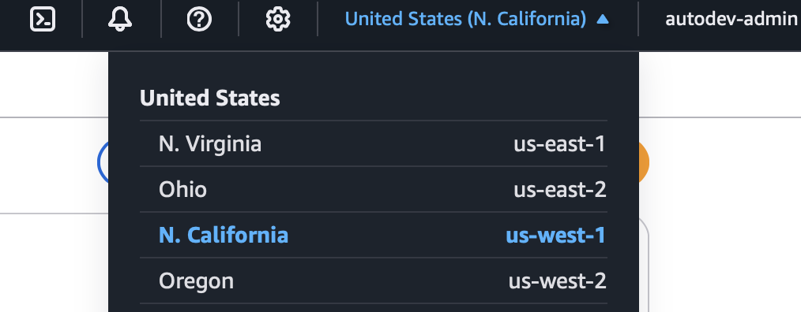
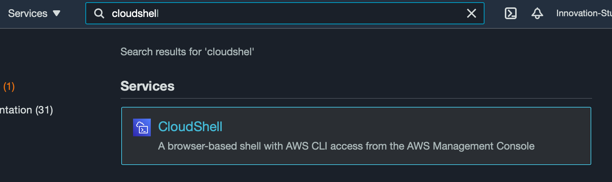

# AWS setup

## Lab Setup
In this lab you will log into the AWS Console and start a CloudShell session. We will be using this for all future labs. 

### Log into the AWS Cloud Console
To log into the console. use the steps provided by the instructor. Once you have logged in, on the top right side, select the `US-West-1` region. 



### Start the CloudShell 
After selecting the `US-West-1` region, use the search bar at the top of the page to search for `CloudShell`. Click on the result shown in the screenshot.


## Cleanup
Remove any files from previous training sessions.
```bash
rm -rf * && rm -rf $HOME/.local
```

## Congratulations
You are now logged into the AWS CloudShell, and ready for future labs. 
